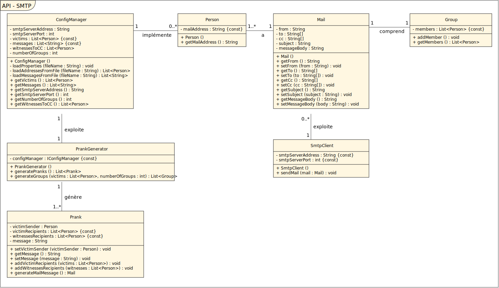

# API-2021-SMTP Rapport

## 1. Introduction

Le but de ce laboratoire est d'initier les étudiants au protocole derrière un **SMTP**, ainsi que de mettre en place le coté client de ce dernier, ensuite d'apprendre à se servir de **serveur Mock** pour testé notre application et vérifier son bon fonctionnement, et pour finir utiliser **Docker** afin de générer des images et des containers.

## 2. Instruction d'installation

Pour pouvoir utiliser les fonctionnalités de ce repo, dénoter tout d'abord qu'un environnement de dévellopement java est nécéssaire pour lancer l'application, si c'est déjà le cas il suffit de clone ce repo pour commencer votre aventure avec le protocole SMTP. Ensuite installer Docker et pour finir il faut utiliser un Mock server pour tester ce que l'on fait ( MockMock, mailtrap, etc..). Ici on utilise MockMock qui vous est fourni dans comme ``.jar`` dans le repo, pour plus d'information aller sur [MockMock](https://github.com/HEIGVD-Course-API/MockMock).

## 3. Instruction d'utilisation

Premièrement, il vous faudra ouvrir le repo sur votre IDE grâce au pom.xml (pour cela, il vous faudra avoir installer maven auparavant). Notre repo est diviser en 2 directory différent: **config** et **src**. config est le directory qui a tous les fichiers liés aux propriétés de notre projet et src contient tout le code de notre application.

Dans le directory **config**, vous trouverez 3 fichiers différents:**Configuration** qui est celui qui a les propriétés de notre application (adresse serveur, port, nombre de personnes par groupe, etc.), **Messages** qui est ou vous écrivez ce que vous désirez envoyer aux victimes (il faut a tout prix finir celui-ci avec ``MESSAGE_END`` pour qu'il soit envoyé sans soucis ou séparer les différents messages que vous voulez écrire). Pour finir,**Victims** qui contient les adresses mail des victimes de votre blague. Vous pouvez en ajoutez autant que vous le désirez, alors ne vous génez pas.

### 3.1 Mise en place de MockMock

``MockMock`` est un cross-plateforme Mock serveur écrit en java avec une interface web utilisé afin de vérifier le bon fonctionnement de l'envoie de mail mais sans être envoyer au adresse mail fourni en réalité. Cela permet de tester dans notre cas notre client du protocole ``SMTP``.

Commencer par ouvrir une invite de commande sur votre machine et aller sur l'emplacement ou se trouve ce repo. Lorsque c'est fait taper la commande suivante sur l'invite :``java -jar MockMock.jar`` pour le run avec les paramètres par défaut (port : 25 et webInterface : 8282), par contre si vous désirez le lancer avec les paramètres que vous désirez faite la commande suivante :``java -jar MockMock.jar -p 2021 -h 8080``, dans ce cas 2021 est le port et 8080 la webInterface définir dans le fichier des propriétés du repo. Si vous souhaitez changer le port, il vous suffit d'ouvrir le fichier configuration dans config et changer la variable smtpServerPort avec ce que vous désirez. Mais n'oublier de faire de même lorsque vous lancer **MockMock**.

### 3.2 Utilisation de Docker

Maintenant on va utiliser **Docker** pour lancer notre serveur Mock sans avoir à effectuer à chaque fois l'étape précédente lorsque l'on veut relancer notre ``MockMock``.

Il faut d'abord par commencer à faire son propre Dockerfile comme montré dans le directory Docker, par contre vous pouvez changer les port ou web interface à votre guise mais n'oublier de faire de même sur les configurations pour éviter de ne pas se connecter au bon serveur. 

Normalement il faudrait lancer cette commande sur l'invite de commande ``mvn clean install --file "<path>\MockMock\pom.xml"`` et copier le jar sur le directory Docker du repo, mais ici le jar pour MockMock est déjà sur le repo.

Ensuite, en ligne de commande faire ``docker build -t <yourInput>/mockmock .`` qui va créer les images nécessaire à Docker (notez que le '.' à la fin est essentiel). Puis, lancer une dernière commande qui est ``docker run -d -p 8080:8080 -p 2021:2021 mockmock`` avec les valeurs que vous avez choisi pour le port et l'interface web.

Pour finir, ouvrez **Docker** et vous devriez voir ``MockMock`` qui run. On peut vérifier en allant sur http://localhost:8080/ mais remplacer le numéro de l'interface web avec celui que vous avez choisi.

### 3.3 Lancement de l'application

Quand vous avez effectué les étapes précèdentes, il ne reste plus qu'à lancer notre application de prank. Pour cela, il faut que vous modifier les fichiers dans le directory config. Ajoutez les addresses mails des victimes, combien de groupes il faut former, etc.

Lorsque c'est fait, il vous suffit de simplement run l'application sur votre IDE et le tour est joué. Si dans la console vous avez le même affichage que montrer dans le directory figures alors c'est que tout à fonctionner correctement. Si chaque réponse du serveur commence par 250 c'est que tout est bon et s'il fini par 221 à la fin c'est que la déconnection c'est fait normalement.

## 4. Présentation des packages java

### 4.1 Config

Ce package est celui qui s'occupe de lire les fichiers dans **config** et les traitent pour pouvoir ensuite les utiliser dans les autres classes de notre application. Il y ``IConfigManager`` qui est l'interface et ``ConfigManager`` la classe qui défini les méthodes de l'interface.

### 4.2 Model

#### 4.2.1 Mail

Package qui s'occupe de créer une ``Person`` qui est décrite que par son adresse mail, qui ensuite l'affecte à un ``Group`` et qui va ensuite créer le faux mail que l'on a doit envoyer au victimes qui sont enfaite nos ``Person`` répartie par ``Group``.
Les trois classes qui composent le package ont en grande partie que des méthodes setter ou getter.

#### 4.2.2 Prank

Ce package est celui qui va générer les groupes de victimes en les séparants en deux genres (l'émetteur victime et les destinataires victimes), sélectionner un des messages écrits dans le directory ``Messages`` et informer le ``SmtpClient`` à qui et quoi envoyer par mail.
``PrankGenerator`` s'occupe de créer les groupes de façon aléatoires et qui est l'émetteurs du groupe. Si un groupe à moins de 3 personnes, il s'occupe de mettre ses membres dans un autre groupe. Effectue ces opérations à l'aide de la classe ``Prank``.
``Prank`` s'occupe de créer et affecter chaque élément nécessaire au bon envoie du mail (La liste des victimes, le message à leur envoyer, etc).

### 4.3 Smtp

C'est dans ce package que l'on retrouve notre implémentation du côté client d'un protocole **SMTP**. Il n'y qu'un seul méthode qui ne s'occupe que d'envoyer des mails à un serveur Mock tout en vérifiant que la communication entre le serveur et le client se fait correctement.

### 4.4 MailRobot

C'est la classe qui relie la totalité des autres classes ensemble et s'occupe donc de se connecter au serveur **SMTP**, de générer les mails de prank et d'envoyer le tout au **Mock**. 

### UML

### 5. Conclusion

Si chaque étape du projet sont effectués correctement et qu'on regarde bien ce que fait chaque chose dans le code ou s'informer sur comment fonctionnent un serveur Mock et Docker, ce dernier est assez simple à mettre en place.

